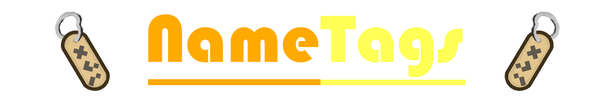

# Basic Features:

* Possibility to create fully custom chat NameTags.
* Add custom permission for each NameTag.
* Fully customizable messages and prefix.

# Requirements:

* **Vault:** The Vault plugin is required to be able to get players prefix.

# Supported Server Versions:

NameTags supports for now only 1.17 versions of Bukkit / Spigot.

**Note** *that this plugin is created for a **CraftBukkit / Spigot** server, so this plugin might not work on a modded server like Tekkit etc.*

Other **CraftBukkit or Spigot derivatives/forks** might work, but are not officially supported. So if you run into issues while using those, try to reproduce your issue on a fresh and up-to-date Spigot server first.

# Commands

# Images

# Getting Started:

* Download the [plugin](https://www.spigotmc.org/resources/nametags.98628/)
* Put the plugin in your plugin folder
* Reload/Restart your server
* Change messages in config.yml ***(optional)***
* You're good to go!
